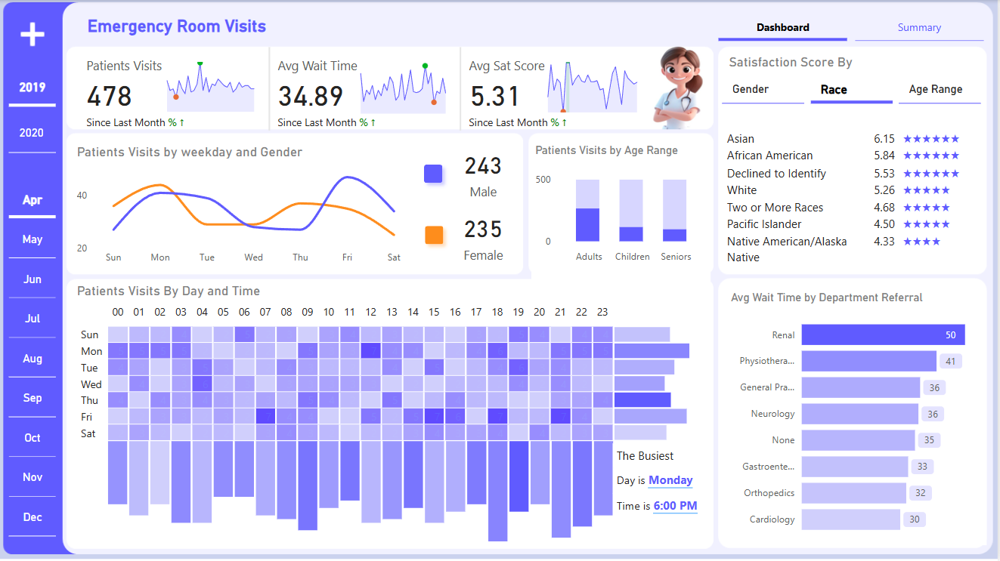
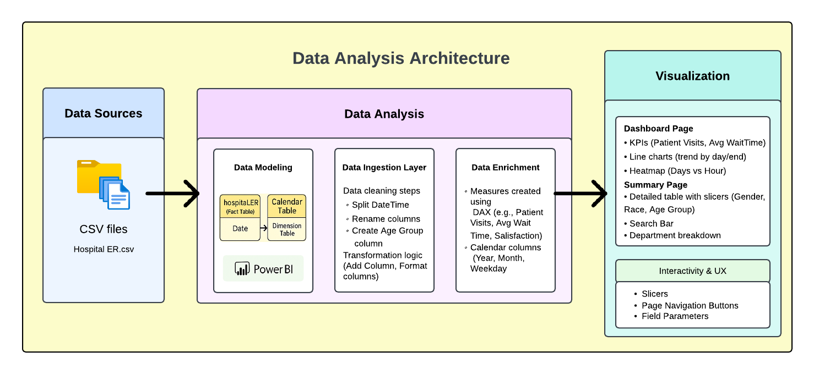

# Healthcare Data Analytics using Power BI

A comprehensive portfolio project demonstrating advanced healthcare analytics skills using Power BI, DAX, and data transformation techniques.

## 🏥 Project Overview: Emergency Department Analytics

This project showcases end-to-end data analysis of hospital emergency department operations with a focus on:
- Patient flow analytics
- Wait time optimization
- Demographic analysis
- Satisfaction score trends
- Department performance metrics

## 💼 Skills Demonstrated

### Data Analysis & Visualization
- Time-series trend analysis
- Demographic pattern identification
- Comparative performance visualization
- KPI tracking and variance analysis
- Hierarchical data representation

### Technical Proficiencies
- **Power BI**: Advanced dashboard development
- **Power Query**: Complex data transformation
- **DAX**: Sophisticated measure creation
- **Data Modeling**: Star schema implementation
- **SQL**: Data extraction and manipulation

### Domain Knowledge
- Healthcare metrics interpretation
- Patient satisfaction analysis
- Wait time optimization strategies
- Resource utilization assessment
- Demographic impact on healthcare outcomes

## 📊 Analysis Methodology

### 1. Data Acquisition & Preparation
- **ETL Process**: Extracted patient visit data from healthcare system exports
- **Data Cleaning**: Standardized formats, handled missing values, removed duplicates
- **Data Enrichment**: Created calculated fields for enhanced analysis
- **Dimensional Modeling**: Implemented calendar dimensions for time intelligence

### 2. Exploratory Data Analysis
- **Temporal Patterns**: Identified high-volume periods by day/hour
- **Demographic Correlations**: Analyzed satisfaction scores across demographic segments
- **Department Efficiency**: Measured wait times by referring department
- **Anomaly Detection**: Flagged unusual patterns in patient flow

### 3. Interactive Dashboard Development
- **Multi-page Layout**: Dashboard view for executives, detailed view for analysts
- **Interactive Elements**: Dynamic slicers, filters, and drill-through functionality
- **Visual Hierarchy**: Organized metrics by importance and relationship
- **Conditional Formatting**: Applied visual cues for performance indicators

### 4. Insight Development
- **Trend Identification**: Tracked patterns in patient volume and satisfaction
- **Performance Benchmarking**: Compared wait times across departments
- **Demographic Impact Analysis**: Evaluated experience across patient segments
- **Resource Optimization Opportunities**: Highlighted peak demand periods

## 🛠️ Tools & Techniques

### Data Transformation
- Date-time manipulation and formatting
- Categorical variable creation and classification
- Statistical aggregation and summarization
- Text parsing and concatenation

### Advanced DAX Formulas
- Time intelligence functions (`DATEADD`, `PREVIOUSMONTH`)
- Statistical measures (`AVERAGE`, `MAX`, `PERCENTILE`)
- Conditional aggregations (`CALCULATE` with filters)
- Ranking and comparison functions

### Visualization Techniques
- Multi-metric KPI cards with trend indicators
- Interactive heat maps for temporal analysis
- Conditional formatting based on thresholds
- Custom tooltips for contextual information

### Data Modeling Techniques
- Star schema implementation
- Role-playing dimensions
- Calculated columns vs. measures
- Relationship cardinality optimization

## 📈 Business Impact

The analysis techniques demonstrated in this project enable healthcare organizations to:
1. Reduce average patient wait times by identifying bottlenecks
2. Improve patient satisfaction through targeted service enhancements
3. Optimize staffing based on predicted patient volume patterns
4. Enhance resource allocation across departments
5. Develop data-driven strategies for continuous improvement

## 🔍 Portfolio Components

This repository includes:
- **Technical Documentation**: Detailed explanation of methodologies used
- **Data Dictionary**: Comprehensive description of all metrics and dimensions
- **Query Examples**: Showcasing data manipulation techniques
- **DAX Formula Library**: Collection of advanced analytical measures
- **Visualization Examples**: Screenshots demonstrating design principles
- **Implementation Guide**: Step-by-step approach to replicating the analysis

## 📚 Knowledge Resources

The analysis incorporates best practices from:
- Healthcare Analytics Association guidelines
- Power BI community optimization techniques
- Healthcare metrics standardization principles
- Data visualization accessibility standards
- HIPAA compliance considerations for healthcare analytics

